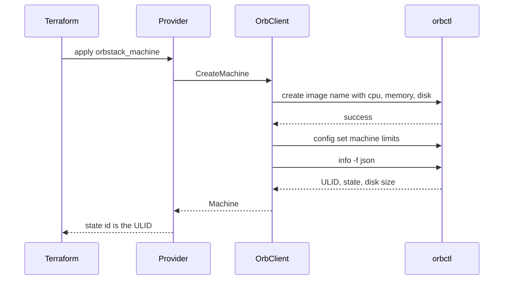
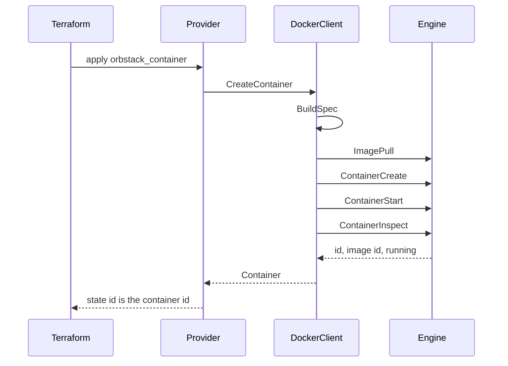
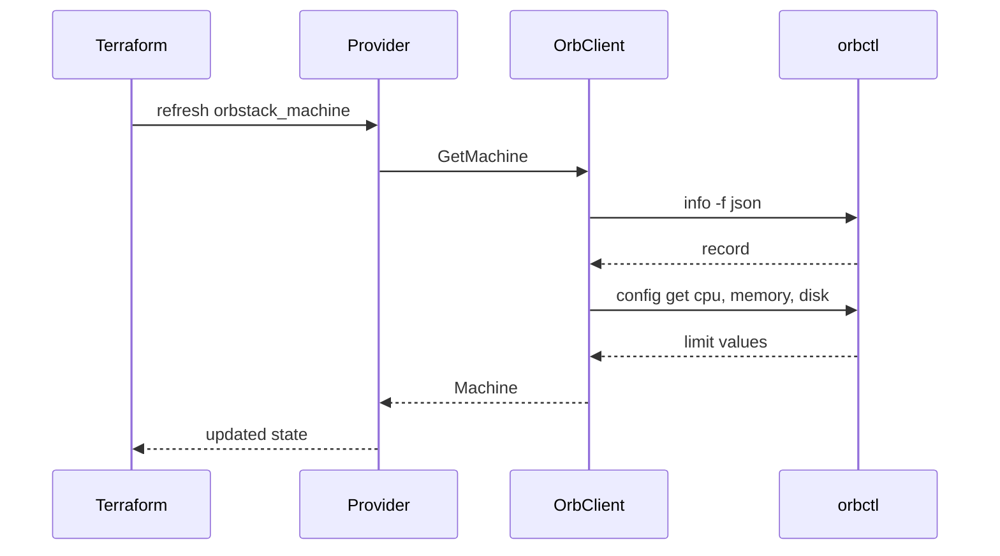

# terraform-provider-orbstack

A Terraform provider for [OrbStack](https://orbstack.dev) on macOS. It creates Linux machines through `orbctl` and containers through the OrbStack Docker engine.

Machines get the limits and isolation flags the community OrbStack provider leaves out: CPU, memory, disk, isolated networking, and host mounts. Containers are one resource. You name an image, and create pulls it. There is no separate image resource and no hand-written Docker socket config.

```hcl
resource "orbstack_machine" "dev" {
  name       = "dev"
  image      = "ubuntu:noble"
  cpus       = 2
  memory_mib = 2048
  disk_gib   = 16
}

resource "orbstack_container" "web" {
  name  = "web"
  image = "nginx:latest"
  ports = { "8080" = "80" }
}
```

## How it works

Terraform talks only to the provider plugin. The provider turns a plan into a request struct and calls a client. It does not build `orbctl` arguments or call the Docker API.

```text
main.go                           plugin entrypoint
internal/provider                 schema, plan, state
internal/orb                      orbctl: machines, limits, cloud-init
internal/docker                   Docker Engine: pull, create, inspect
```

Machine calls go to `internal/orb`, which runs `orbctl` and decodes JSON. Container calls go to `internal/docker`, which uses the Docker Engine API on the OrbStack socket. The split is [ADR 0001](docs/adr/0001-client-libraries.md). A longer map of the packages is in [docs/architecture.md](docs/architecture.md).

### Create a machine

`apply` on `orbstack_machine` calls `CreateMachine`. The client creates the VM, writes CPU, memory, and disk into OrbStack config, then reads the machine back. State stores the ULID from `orbctl info`, not the name.



If `power_state` is `stopped`, the client stops the machine before that final read. If `default_machine` is true, it selects the machine with `orbctl default` before that read.

### Create a container

`apply` on `orbstack_container` calls `CreateContainer`. The client builds a Docker `Config` and `HostConfig`, pulls the image, creates the container, starts it, and inspects it. The stored id is the container id from inspect.



`Engine` is the OrbStack Docker socket. Provider configuration resolves that socket and does not dial it. The pull is the first connection.

### Refresh a machine

`plan` and `apply` refresh state before they compare it with the configuration. Refresh calls `GetMachine`, which reads `orbctl info` and the limit keys. A limit of `0` means unlimited and is stored as null.



A missing machine drops the resource from state. The next plan creates it again.

## Decisions worth reading

| ADR | Decision |
| --- | --- |
| [0001](docs/adr/0001-client-libraries.md) | Client libraries are independent of the Terraform schema |
| [0002](docs/adr/0002-orbctl-and-docker-engine.md) | Machines use `orbctl`; containers use the Docker Engine API |
| [0003](docs/adr/0003-container-resource-shape.md) | One container resource, implicit pull, map-style ports and env |
| [0004](docs/adr/0004-machine-identity-and-lifecycle.md) | Machine id is the OrbStack ULID; replace only what create cannot change |
| [0005](docs/adr/0005-offline-tests.md) | `go test` never starts OrbStack or Docker |

More detail is in [docs/architecture.md](docs/architecture.md) and [docs/usage.md](docs/usage.md).

## Requirements

- macOS
- [OrbStack](https://orbstack.dev) with `orbctl` on `PATH`
- Terraform 1.6 or newer
- Go 1.25 or newer, to build the provider

## Build and test

```bash
go test ./...
go build -o terraform-provider-orbstack .
```

`go test` does not create machines or pull images. To point a real configuration at a local binary, see [docs/development.md](docs/development.md).

## Scope

In this pass:

- `orbstack_machine` and `orbstack_container`
- data sources `orbstack_machine`, `orbstack_machines`, and `orbstack_container`

Intentionally absent: Kubernetes, Compose, image builds, custom networks, healthchecks, registry auth, USB and serial devices, and file copy onto a machine. OrbStack's `push` command has no delete, so a file resource would be a poor fit for Terraform.

The provider address is `registry.terraform.io/machugram/orbstack`. A `v*` tag pushes a signed GitHub release. Publishing that release on the Terraform Registry still requires the signing key on the `machugram` namespace. Local development uses a dev override, described in [docs/development.md](docs/development.md).

## License

[MIT License](LICENSE).
